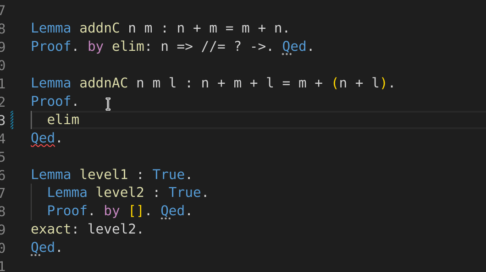
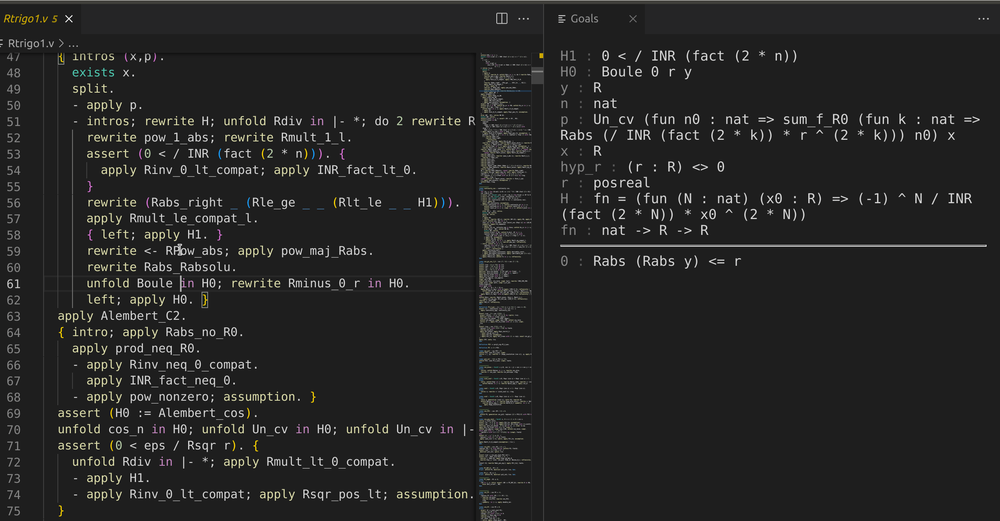
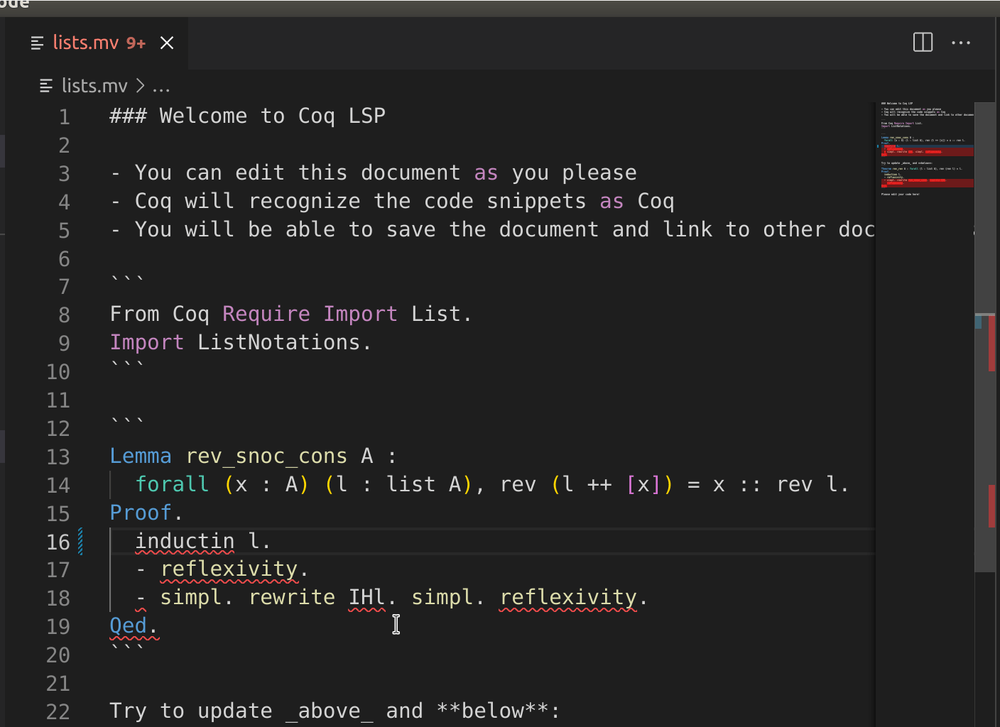
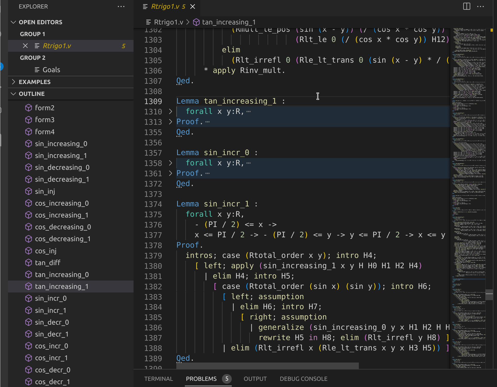
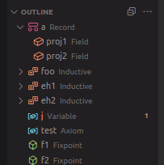
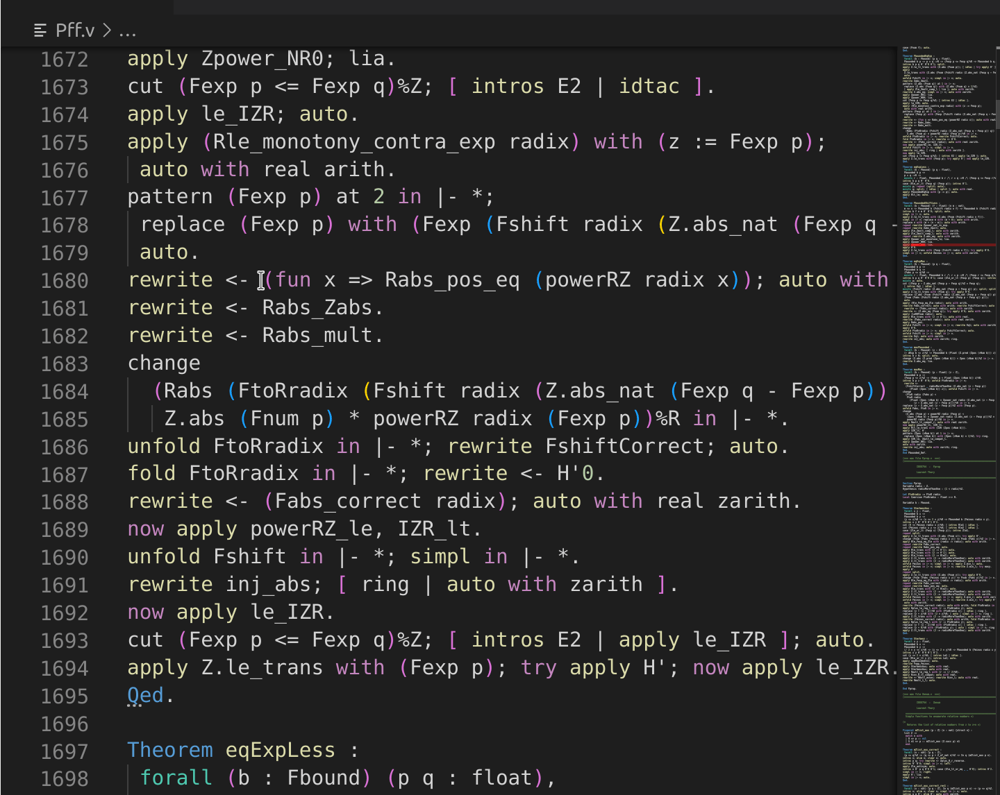
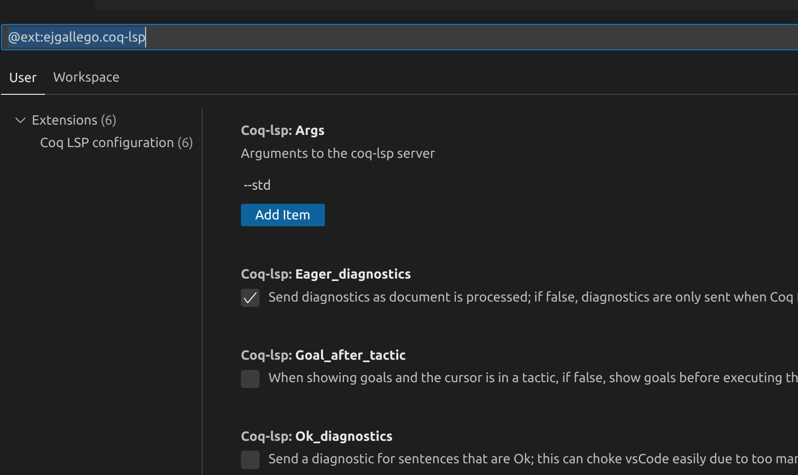

# Coq LSP <!-- omit in toc -->

[![Github CI][ci-badge]][ci-link]

`coq-lsp` is a [Language
Server](https://microsoft.github.io/language-server-protocol/) and [Visual
Studio Code](https://code.visualstudio.com/) extension for the [Coq Proof
Assistant](https://coq.inria.fr).

Key [features](#Features) of `coq-lsp` are continuous and incremental document
checking, advanced error recovery, markdown support, positional goals and
information panel, performance data, and more.

`coq-lsp` aims to provide a seamless, modern interactive theorem proving
experience, as well as to serve as a platform for research and UI integration
with other projects.

`coq-lsp` is built on top of **Flèche**, a new document checking engine for
formal documents, designed from our experience in
[previous](https://github.com/ejgallego/coq-serapi/)
[projects](https://github.com/jscoq/jscoq). Flèche is specifically optimized for
interactive use, and provides extra features from vanilla Coq.

## Table of Contents <!-- omit in toc -->

- [🎁 Features](#-features)
  - [⏩ Incremental Compilation and Continuous Document Checking](#-incremental-compilation-and-continuous-document-checking)
  - [🧠 Smart, Cache-Aware Error Recovery](#-smart-cache-aware-error-recovery)
  - [🥅 Whole-Document Goal Display](#-whole-document-goal-display)
  - [🗒️ Markdown Support](#️-markdown-support)
  - [👥 Document Outline](#-document-outline)
  - [🔎 Document Hover](#-document-hover)
  - [⏱️ Detailed Timing and Memory Statistics](#️-detailed-timing-and-memory-statistics)
  - [🔧 Client-Side Configuration Options](#-client-side-configuration-options)
  - [♻️ Reusability, Standards, Modularity](#️-reusability-standards-modularity)
  - [🔎 A Platform for Research!](#-a-platform-for-research)
- [🛠️ Installation](#️-installation)
  - [Supported Coq Versions](#supported-coq-versions)
  - [Server](#server)
  - [Visual Studio Code](#visual-studio-code)
  - [Neovim](#neovim)
- [🗣️ Discussion Channel](#️-discussion-channel)
- [☎ Weekly Calls](#-weekly-calls)
- [❓FAQ](#faq)
- [⁉️ Troubleshooting and Known Problems](#️-troubleshooting-and-known-problems)
  - [Working With Multiple Files](#working-with-multiple-files)
- [📔 Planned Features](#-planned-features)
- [📕 Protocol Documentation](#-protocol-documentation)
- [🤸 Contributing](#-contributing)
- [🌐 Team](#-team)
  - [Past Contributors](#past-contributors)
- [©️ Licensing Information](#️-licensing-information)
- [👏 Acknowledgments](#-acknowledgments)

## 🎁 Features

### ⏩ Incremental Compilation and Continuous Document Checking

Edit your file, and `coq-lsp` will try to re-check only what is necessary,
continuously. No more dreaded `Ctrl-C Ctrl-N`! Rechecking tries to be smart,
and will ignore whitespace changes.



In a future release, `coq-lsp` will save its document cache to disk, so you can
restart your proof session where you left it at the last time.

Incremental support is undergoing refinement, if `coq-lsp` rechecks when it
should not, please file a bug!

### 🧠 Smart, Cache-Aware Error Recovery

`coq-lsp` won't stop checking on errors, but supports (and encourages) working
with proof documents that are only partially working. Moreover, error recovery
integrates with the incremental cache, and will recognize proof structure.

You can edit without fear inside a `Proof. ... Qed.`, the rest of the document
won't be rechecked, unless the proof is completed.


Furthermore, you can leave bullets and focused goals unfinished, and `coq-lsp`
will automatically admit them for you.

### 🥅 Whole-Document Goal Display

Press `Alt+Enter` (or `Cmd+Enter` in Mac) to show goals at point in a side
panel.



The panel will also include goals that you have given up or shelved. This panel
will also show the current info about open bullets and their goals.

### 🗒️ Markdown Support

Open a markdown file with a `.mv` extension, `coq-lsp` will check the code parts
that are enclosed into `coq` language blocks! `coq-lsp` places human-friendly
documents at the core of its design ideas.



### 👥 Document Outline

`coq-lsp` supports document outline and code folding, allowing you to jump
directly to definitions in the document. Many of the Coq vernacular commands
like `Definition`, `Theorem`, `Lemma`, etc. will be recognized as document
symbols which you can navigate to or see the outline of.


 

### 🔎 Document Hover

Hovering over a Coq identifier will show its type.


### ⏱️ Detailed Timing and Memory Statistics

Hover over any Coq sentence, `coq-lsp` will display detailed memory and timing
statistics.



### 🔧 Client-Side Configuration Options

`coq-lsp` is configurable, and tries to adapt to your own workflow. What to do
when a proof doesn't check, admit or ignore? You decide!

See the `coq-lsp` extension configuration in VSCode for options available.



### ♻️ Reusability, Standards, Modularity

The incremental document checking library of `coq-lsp` has been designed to be
reusable by other projects written in OCaml and with needs for document
validation UI, as well as by other Coq projects such as jsCoq.

Moreover, we are strongly based on standards, aiming for the least possible
extensions.

### 🔎 A Platform for Research!

A key `coq-lsp` goal is to serve as central platform for researchers in
Human-Computer-Interaction, Machine Learning, and Software Engineering willing
to interact with Coq.

Towards this goal, `coq-lsp` extends and will eventually replace `coq-serapi`,
which has been used by many to that purpose.

## 🛠️ Installation

In order to use `coq-lsp` you'll need to install [**both**](etc/FAQ.md)
`coq-lsp` and a suitable client. We recommend the Visual Studio Code Extension.

### Supported Coq Versions

`coq-lsp` supports Coq 8.16, Coq 8.17, and Coq's `master` branch.

We recommended a minimum of Coq 8.17, due to better test coverage for that
version.  We also recommend users to install the custom Coq trees for 8.16 and
8.17 as detailed in [Working With Multiple Files](#working-with-multiple-files)

Support for older Coq versions is possible; it is possible to make `coq-lsp`
work with Coq back to Coq 8.10/8.9. If you are interested in making that happen
don't hesitate to get in touch with us.

### Server

- **opam**:
  ```
  opam install coq-lsp
  ```
- **Nix**:
   - In nixpkgs: [#213397](https://github.com/NixOS/nixpkgs/pull/213397)
   - In your flake:
   ```nix
   inputs.coq-lsp.url = "github:ejgallego/coq-lsp";
   ...
   coq-lsp.packages.${system}.default
   ```
- **Coq Platform** (coming soon)
- [Do it yourself!](#server-1)

### Visual Studio Code
- Official Marketplace: https://marketplace.visualstudio.com/items?itemName=ejgallego.coq-lsp
- Open VSX: https://open-vsx.org/extension/ejgallego/coq-lsp
- Nix:
```nix
inputs.coq-lsp.url = "github:ejgallego/coq-lsp";
...
programs.vscode = {
  enable = true;
  extensions = with pkgs.vscode-extensions; [
    ...
    inputs.coq-lsp.packages.${pkgs.system}.vscode-extension
    ...
  ];
};
```

### Neovim
- Experimental client by Jaehwang Jung: https://github.com/tomtomjhj/coq-lsp.nvim

## 🗣️ Discussion Channel

`coq-lsp` discussion channel it at [Coq's
Zulip](https://coq.zulipchat.com/#narrow/stream/329642-coq-lsp), don't hesitate
to stop by; both users and developers are welcome.

## ☎ Weekly Calls

We hold (almost) weekly video conference calls, see the [Call Schedule
Page](https://github.com/ejgallego/coq-lsp/wiki/Coq-Lsp-Calls) for more
information. Everyone is most welcome!

## ❓FAQ

See our [list of frequently-asked questions](./etc/FAQ.md).

## ⁉️ Troubleshooting and Known Problems

- Some problems can be resolved by restarting `coq-lsp`, in Visual Studio Code,
  `Ctrl+Shift+P` will give you access to the `coq-lsp.restart` command.
- In VSCode, the "Output" window will have a "Coq LSP Server Events" channel
  which should contain some important information; the content of this channel
  is controlled by the `Coq LSP > Trace: Server` option.
- If you install `coq-lsp` simultaneously with VSCoq, VSCode gets confused and
  neither of them may work. `coq-lsp` will warn about that. If you know how to
  improve this, don't hesitate to get in touch with us.
- VS Code may send request completions with a stale document, this will be fixed
  in a new upstream release, c.f. https://github.com/ejgallego/coq-lsp/issues/273

### Working With Multiple Files

`coq-lsp` can't work with more than one file at the same time, due to problems
with parsing state management upstream. This was fixed in Coq `master` branch
(to become **Coq 8.18**).

As this is very inconvenient, we do provide a fixed Coq branch that you can
install using `opam pin`:

- For Coq 8.17:
  ```
  opam pin add coq-core https://github.com/ejgallego/coq.git#v8.17+lsp
  ```
- For Coq 8.16:
  ```
  opam pin add coq https://github.com/ejgallego/coq.git#v8.16+lsp
  ```

## 📔 Planned Features

See [planned features and contribution ideas](etc/ContributionIdeas.md) for a
list of things we'd like to happen.

## 📕 Protocol Documentation

`coq-lsp` mostly implements the [LSP
Standard](https://microsoft.github.io/language-server-protocol/specifications/lsp/3.17/specification/),
plus some extensions specific to Coq.

Check [the `coq-lsp` protocol documentation](etc/doc/PROTOCOL.md) for more details.

## 🤸 Contributing

Contributions are very welcome! Feel free to chat with the dev team in
[Zulip](https://coq.zulipchat.com/#narrow/stream/329642-coq-lsp) for any
question, or just go ahead and hack.

We have a [contributing guide](CONTRIBUTING.md), which includes a description of
the organization of the codebase, developer workflow, and more.

Here is a [list of project ideas](etc/ContributionIdeas.md) that could be of
help in case you are looking for contribution ideas, tho we are convinced that
the best ideas will arise from using `coq-lsp` in your own Coq projects.

## 🌐 Team

- Ali Caglayan (co-coordinator)
- Emilio J. Gallego Arias (Inria Paris, co-coordinator)
- Shachar Itzhaky (Technion)
- Ramkumar Ramachandra (Inria Paris)

### Past Contributors

- Vincent Laporte (Inria)

## ©️ Licensing Information

The license for this project is LGPL 2.1 (or GPL 3+ as stated in the LGPL 2.1).

- This server forked from our previous LSP implementation for the
  [Lambdapi](https://github.com/Deducteam/lambdapi) proof assistant, written by
  Emilio J. Gallego Arias, Frédéric Blanqui, Rodolphe Lepigre, and others; the
  initial port to Coq was done by Emilio J. Gallego Arias and Vicent Laporte.

- Syntax files in editor/code are partially derived from
  [VSCoq](https://github.com/siegebell/vscoq) by Christian J. Bell, distributed
  under the terms of the MIT license (see ./editor/code/License-vscoq.text).

## 👏 Acknowledgments

Work on this server has been made possible thanks to many discussions,
inspirations, and sharing of ideas from colleagues. In particular, we'd like to
thank Rudi Grinberg, Andrey Mokhov, Clément Pit-Claudel, and Makarius Wenzel for
their help and advice.

As noted above, the original implementation was based on the Lambdapi LSP
server, thanks to all the collaborators in that project!

[ci-badge]: https://github.com/ejgallego/coq-lsp/actions/workflows/build.yml/badge.svg
[ci-link]: https://github.com/ejgallego/coq-lsp/actions/workflows/build.yml

<!-- Local Variables: -->
<!-- mode: Markdown -->
<!-- fill-column: 80 -->
<!-- End: -->
